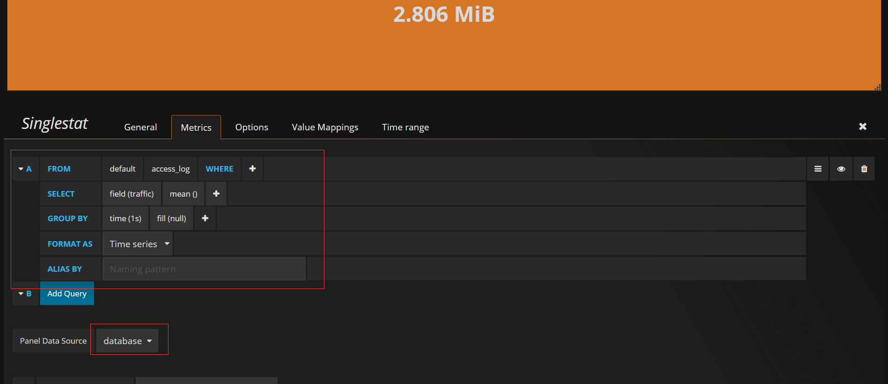
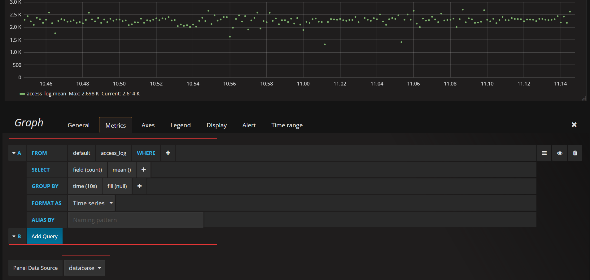

# 日志分析监控案例

这个脚本的数据记录在influshDB中，数据聚合Grafana可以自己完成。这个脚本主要分析记录的数据有：访问次数count，流量traffic，错误率error_rate。访问次数可以借助influxDB显示每秒的访问次数，也就是QPS。

```python
#!/usr/bin/python3
import os
import re
import datetime
import threading
import requests

# 日志切词
o = re.compile(r'(?P<ip>\d{1,3}\.\d{1,3}\.\d{1,3}\.\d{1,3}) .* .* \[(?P<time>.*)\] "(?P<method>\w+) (?P<url>[^\s]*) (?P<version>[\w|/\.\d]*)" (?P<status>\d{3}) (?P<length>\d+) "(?P<referer>[^\s]*)" "(?P<ua>.*)"')

# 每隔0.1秒重上次读到的位置读日志
def read_log(path):
    offset = 0
    event = threading.Event()
    while not event.is_set():
        with open(path) as f:
            if offset > os.stat(path).st_size:
                offset = 0
            f.seek(offset)
            yield from f
            offset = f.tell()
        event.wait(0.1)


# 调用日志切词，并返回切词结果
def parse(path):
    for line in read_log(path):
        m = o.search(line.rstrip('\n'))
        if m:
            data = m.groupdict()
            yield data


# 对切词结果进行统计，并调用send发送统计的数据
def agg(path='/usr/local/nginx/logs/access.log', interval=10):
    count = 0
    traffic = 0
    error = 0
    start = datetime.datetime.now()
    for item in parse(path):
        # print(item)
        count += 1
        traffic += int(item['length'])
        if int(item['status']) >= 300:
            error += 1
        current = datetime.datetime.now()
        # print((current - start).total_seconds())
        if (current - start).total_seconds() >= interval:
            error_rate = error / count
            send(count, traffic, error_rate)
            start = current
            count = 0
            #traffic = 0
            error = 0


# 写数据到influshDB
def send(count, traffic, error_rate):
    line = 'access_log count={},traffic={},error_rate={}'.format(count, traffic, error_rate)
    #print(line)
    requests.post('http://127.0.0.1:8086/write', auth=('admin', 'password'), data=line, params={'db': 'nginx'})
    # if res.status_code >= 300:
        # print(res.content)


if __name__ == '__main__':
    import sys
    agg(path=sys.argv[1])

```

## Grafana添加监控

每秒流量



QPS

