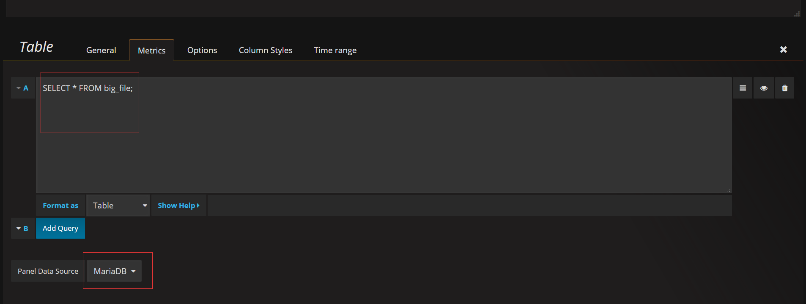

# 视频文件大切片

一个直播网站，视频被切片之后，总是会出现一些较大的切片，当源站点带宽资源紧张的时候，很容易造成视频卡顿。每当有连续大切片出现，代表着有些视频可能没有正确的转码就上传到服务器上了，根据大切片我们很容易排查出哪些视频没有转码。

```python
#!/usr/bin/python3
import os
import re
import pymysql
import datetime


# 找出当前正在直播的直播流名称
def file_name(path='/NIIS/FileRoot/live/'):
    file = os.listdir(path)
    # print(file)
    for i in file:
        if re.search(r'm3u8', i):
            for y in os.listdir('{}/Ts/{}'.format(path, i[0:32])):
                yield '{}Ts/{}/{}'.format(path, i[0:32], y)


# 以M为单位返回视频切片大小
def format_size(size):
    size = round(size / 1048576, 2)
    return '{}M'.format(size)


# 清空数据库数据
def clear_data():
    db = pymysql.connect("127.0.0.1", "grafana", "grafana", "grafana")
    db.cursor().execute('DELETE FROM big_file')
    db.commit()
    db.close()


# 记录大文件的名称和文件大小
def insert_data(file, size):
    db = pymysql.connect("127.0.0.1", "grafana", "grafana", "grafana")
    if not db.cursor().execute(
            "SELECT size from big_file WHERE file='{}'".format(file)):
        db.cursor().execute(
            "INSERT INTO big_file (file,size) VALUES ('{}','{}')".format(
                file, size))
    db.commit()
    db.close()


def main():
    # time = datetime.datetime.now().strftime('%d')
    for i in file_name():
        sizefile = os.stat(i).st_size
        # if datetime.datetime.now().strftime('%d') != time:
        #     clear_data()
        if sizefile > 2097152:
            insert_data(i, format_size(sizefile))


if __name__ == '__main__':
    main()
```

## 数据库表结构

```sql
USE `grafana`;

CREATE TABLE `big_file` (
  `file` varchar(100) DEFAULT NULL,
  `size` varchar(20) DEFAULT NULL
) ENGINE=InnoDB DEFAULT CHARSET=latin1;
```

## Grafana添加监控

