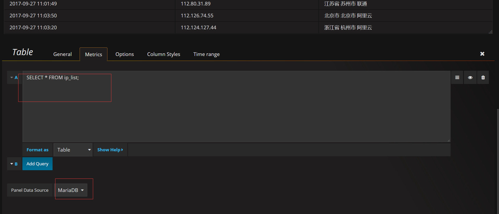

# 访问ip分析

一个只提供视频服务的站点，对回源ip的控制尤其重要，这里就写了一个回源ip分析的脚本。这里使用MySQL作为数据是因为influxDB不能良好的记录数据

```python
#!/usr/bin/python3
# coding: gb2312
import re
import argparse
import datetime
import threading
import os
import pymysql
import urllib.request
import json

# 传递参数
parser = argparse.ArgumentParser(
    prog='Access IP', description='每有ip访问服务器就会记录到日志中且不记录重复ip,每隔10分钟后记录一次重复ip')
parser.add_argument(
    '-time',
    dest='Wait_time',
    type=int,
    default=600,
    help='-time 设置隔多长时间记录一次重复ip')
parser.add_argument(
    '-file_path',
    dest='file_path',
    default='/usr/local/nginx/logs/access.log',
    # default='./access.log',
    help='-file_path http日志位置，默认处理/usr/local/nginx/logs/access.log')
parser.add_argument(
    '-log_path',
    dest='log_path',
    default='/var/log/zabbix/ip.log',
    # default='./ip.log',
    help='-log_path 停用了，处理结果保存路径，默认保存到/var/log/zabbix/ip.log')
args = parser.parse_args()
# 日志切词
o = re.compile(r'(?P<ip>\d{1,3}\.\d{1,3}\.\d{1,3}\.\d{1,3}) (?P<other>.*)')


# 每0.1秒读刚写入的日志
def open_log(path):
    offset = 0
    event = threading.Event()
    while not event.is_set():
        with open(path) as f:
            if offset > os.stat(path).st_size:
                offset = 0
            f.seek(offset)
            yield from f
            offset = f.tell()
        event.wait(1)


# 每隔多长时间重新记录访问ip
def analyzer(path):
    Last_time = datetime.datetime.now()
    ip_list = []
    for line in open_log(path):
        # t = datetime.datetime.now() - Last_time
        # print(t)
        if datetime.datetime.now() - Last_time > datetime.timedelta(
                seconds=args.Wait_time):
            # print('1')
            ip_list = []
            clear_data()
            Last_time = datetime.datetime.now()
            # f = open(args.log_path, 'w')
            # f.close()
        # print(Last_time)
        m = o.search(line.rstrip('\n'))
        # print(m)
        if m:
            d = m.groupdict()
            # print(d)
            if d['ip'] not in ip_list:
                ip_list.append(d['ip'])
                # print(ip_list)
                yield d['ip']


# 清空数据
def clear_data():
    db = pymysql.connect("127.0.0.1", "grafana", "grafana", "grafana")
    db.cursor().execute('DELETE FROM ip_list')
    db.commit()
    db.close()


# 获取ip的地理位置信息
def ip_address(ip):
    apiurl = 'http://ip.taobao.com/service/getIpInfo.php?ip={}'.format(ip)
    data = urllib.request.urlopen(apiurl).read()
    data = json.loads(str(data, encoding="utf-8"))['data']
    if not data['region']:
        return '{}'.format(data['country'])
    return '{} {} {}'.format(data['region'], data['city'], data['isp'])


# 写入数据
def insert_data(time, ip):
    address = ''
    address = ip_address(ip)
    db = pymysql.connect("127.0.0.1", "grafana", "grafana", "grafana")
    db.cursor().execute(
        "INSERT INTO ip_list (time,ip,source) VALUES ('{}','{}','{}')".
        format(time, ip, address))
    db.commit()
    db.close()


if __name__ == '__main__':
    for i in analyzer(args.file_path):
        # print(i)
        Now_time = datetime.datetime.now().strftime('%Y-%m-%d %H:%M:%S')
        # 下面两行是写Now_time和i到文件中，如果记录数据到文件中需要同时取消59,60行的注释
        # with open(args.log_path, 'a') as logf:
        #     logf.write('[{}] {}\n'.format(Now_time, i))
        # 下面一行是写数据到数据库中，这一行需要57
        # 行的配合
        insert_data(Now_time, i)
```

## 数据库表结构

```sql
USE `grafana`;

CREATE TABLE `ip_list` (
  `time` varchar(50) DEFAULT NULL,
  `ip` varchar(20) DEFAULT NULL,
  `source` varchar(20) DEFAULT NULL
) ENGINE=InnoDB DEFAULT CHARSET=gbk;
```

## Grafana添加监控

