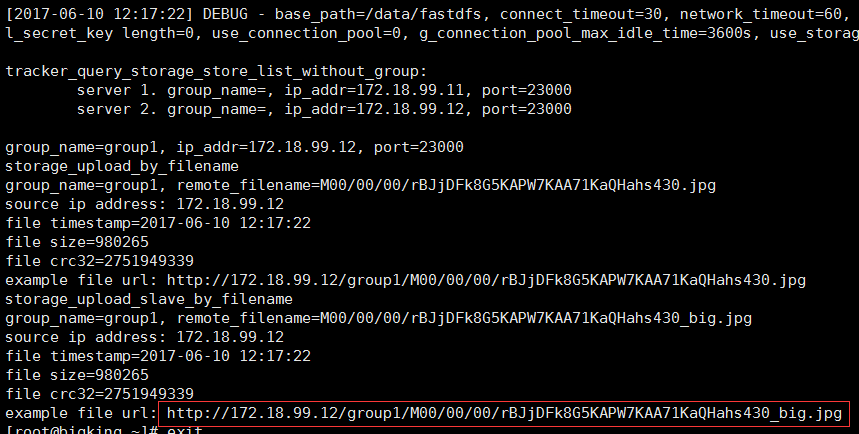

原理请参考http://www.tuicool.com/articles/YniEnyf

# fastdfs部署

```bash
yum -y install make cmake gcc gcc-c++ git
cd
git clone https://github.com/happyfish100/libfastcommon.git
cd libfastcommon/
./make.sh && ./make.sh install
cd
git clone https://github.com/happyfish100/fastdfs.git
cd fastdfs/
./make.sh && ./make.sh install

```

# tracker服务器配置

`cp /etc/fdfs/tracker.conf.sample /etc/fdfs/tracker.conf`复制配置文件

```bash
vim /etc/fdfs/tracker.conf

# 启用配置文件
disabled=false
# tracker服务器端口（默认22122）
port=22122
# 存储日志和数据的根目录
base_path=/fastdfs/tracker
# 保存数据到哪个组
store_group=group1
```

`mkdir -p /fastdfs/tracker`创建目录

`/etc/init.d/fdfs_trackerd start`启动服务

# storage服务器配置

`cp /etc/fdfs/storage.conf.sample /etc/fdfs/storage.conf`复制配置文件

```bash
vi /etc/fdfs/storage.conf

# 启用配置文件
disabled=false                   
# storage服务端口   
port=23000                          
# 数据和日志文件存储根目录
base_path=/fastdfs/storage          
# 第一个存储目录
store_path0=/fastdfs/storage        
# tracker服务器IP和端口
tracker_server=10.100.139.121:22122  
#tracker服务器IP2和端口[Microsof1]
tracker_server=10.100.138.180:22122  
# http访问文件的端口
http.server_port=8888               
```

mkdir -p /fastdfs/storage

# client配置
`cp /etc/fdfs/client.conf.sample /etc/fdfs/client.conf`复制配置文件

```bash
vi /etc/fdfs/client.conf

# 工作目录
base_path=/data/fastdfs
# tracker_server的地址
tracker_server=172.18.99.10:22122
```

# nginx配置

```bash
cd
# 安装nginx依赖的开发包
yum -y install pcre-devel openssl-devel
# 下载解压nginx源码包
wget http://nginx.org/download/nginx-1.12.0.tar.gz
tar xvf nginx-1.12.0.tar.gz
# 下载fastdfs-nginx-module包
git clone https://github.com/happyfish100/fastdfs-nginx-module.git
# 设置编译参数
cd nginx-1.12.0
./configure \
  --prefix=/usr \
  --sbin-path=/usr/sbin/nginx \
  --conf-path=/etc/nginx/nginx.conf \
  --error-log-path=/var/log/nginx/error.log \
  --http-log-path=/var/log/nginx/access.log \
  --pid-path=/var/run/nginx/nginx.pid  \
  --lock-path=/var/lock/nginx.lock \
  --user=nginx \
  --group=nginx \
  --with-http_ssl_module \
  --with-http_flv_module \
  --with-http_stub_status_module \
  --with-http_gzip_static_module \
  --http-client-body-temp-path=/var/tmp/nginx/client/ \
  --http-proxy-temp-path=/var/tmp/nginx/proxy/ \
  --http-fastcgi-temp-path=/var/tmp/nginx/fcgi/ \
  --http-uwsgi-temp-path=/var/tmp/nginx/uwsgi \
  --http-scgi-temp-path=/var/tmp/nginx/scgi \
  --with-pcre \
  --with-debug \
  --add-module=../fastdfs-nginx-module/src/
make && make install
# 添加nginx用户
useradd -r nginx
# 添加nginx服务脚本文件

# 提供配置文件
cp /root/fastdfs-nginx-module/src/mod_fastdfs.conf /etc/fdfs/
cp /root/fastdfs/conf/{http.conf,mime.types}  /etc/fdfs/
```

需要手动更改的部分，其实也可以写脚本，只是不方便理解

nginx服务器脚本如下

```bash
vi /etc/init.d/nginx

#!/bin/sh
#
# nginx - this script starts and stops the nginx daemon
#
# chkconfig:   - 85 15
# description:  Nginx is an HTTP(S) server, HTTP(S) reverse \
#               proxy and IMAP/POP3 proxy server
# processname: nginx
# config:      /etc/nginx/nginx.conf
# config:      /etc/sysconfig/nginx
# pidfile:     /var/run/nginx.pid

# Source function library.
. /etc/rc.d/init.d/functions

# Source networking configuration.
. /etc/sysconfig/network

# Check that networking is up.
[ "$NETWORKING" = "no" ] && exit 0

nginx="/usr/sbin/nginx"
prog=$(basename $nginx)

NGINX_CONF_FILE="/etc/nginx/nginx.conf"

[ -f /etc/sysconfig/nginx ] && . /etc/sysconfig/nginx

lockfile=/var/lock/subsys/nginx

make_dirs() {
   # make required directories
   user=`nginx -V 2>&1 | grep "configure arguments:" | sed 's/[^*]*--user=\([^ ]*\).*/\1/g' -`
   options=`$nginx -V 2>&1 | grep 'configure arguments:'`
   for opt in $options; do
       if [ `echo $opt | grep '.*-temp-path'` ]; then
           value=`echo $opt | cut -d "=" -f 2`
           if [ ! -d "$value" ]; then
               # echo "creating" $value
               mkdir -p $value && chown -R $user $value
           fi
       fi
   done
}

start() {
    [ -x $nginx ] || exit 5
    [ -f $NGINX_CONF_FILE ] || exit 6
    make_dirs
    echo -n $"Starting $prog: "
    daemon $nginx -c $NGINX_CONF_FILE
    retval=$?
    echo
    [ $retval -eq 0 ] && touch $lockfile
    return $retval
}

stop() {
    echo -n $"Stopping $prog: "
    killproc $prog -QUIT
    retval=$?
    echo
    [ $retval -eq 0 ] && rm -f $lockfile
    return $retval
}

restart() {
    configtest || return $?
    stop
    sleep 1
    start
}

reload() {
    configtest || return $?
    echo -n $"Reloading $prog: "
    killproc $nginx -HUP
    RETVAL=$?
    echo
}

force_reload() {
    restart
}

configtest() {
  $nginx -t -c $NGINX_CONF_FILE
}

rh_status() {
    status $prog
}

rh_status_q() {
    rh_status >/dev/null 2>&1
}

case "$1" in
    start)
        rh_status_q && exit 0
        $1
        ;;
    stop)
        rh_status_q || exit 0
        $1
        ;;
    restart|configtest)
        $1
        ;;
    reload)
        rh_status_q || exit 7
        $1
        ;;
    force-reload)
        force_reload
        ;;
    status)
        rh_status
        ;;
    condrestart|try-restart)
        rh_status_q || exit 0
            ;;
    *)
        echo $"Usage: $0 {start|stop|status|restart|condrestart|try-restart|reload|force-reload|configtest}"
        exit 2
esac
```

`chmod +x /etc/init.d/nginx`添加执行权限

```bash
vim /etc/fdfs/mod_fastdfs.conf

#存储节点的目录位置
base_path=/fastdfs/storage
#制定tracker-server
tracker_server=172.18.99.10:22122
storage_server_port=23000
#制定组名
group_name=group1
#访问路径中是否包括组名
url_have_group_name = true  
#配置路径个数
store_path_count=1
#指定要查看的路径
store_path0=/fastdfs/storage/
```

```bash
vi /etc/nginx/nginx.conf

# 添加一个location
location /group1/M00/ {
    root   /fastdfs/storage/;
    ngx_fastdfs_module;
}
```

***多组多磁盘示例，仅供参考***

```bash
vi /etc/nginx/nginx.conf

# 添加一个location
location /group1/M00/ {
    root   /fastdfs/storage/m00;
    ngx_fastdfs_module;
}
location /group1/M01/ {
    root   /fastdfs/storage/m01;
    ngx_fastdfs_module;
}
location /group2/M00/ {
    root   /fastdfs/storage/m00;
    ngx_fastdfs_module;
}
```

`service nginx start`启动nginx服务


# 测试

`fdfs_test /etc/fdfs/client.conf upload /usr/share/backgrounds/morning.jpg`上传一个文件

上传文件后截图如下



使用浏览器访问如下路径http://172.18.99.12/group1/M00/00/00/rBJjDFk8G5KAPW7KAA71KaQHahs430_big.jpg
