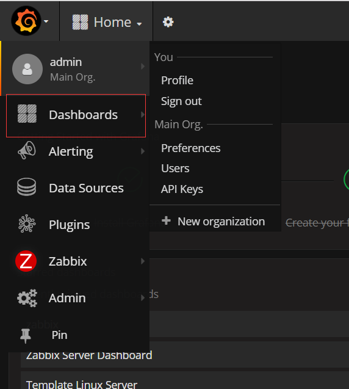
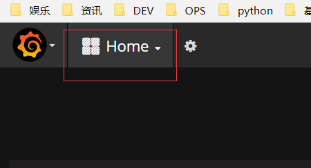
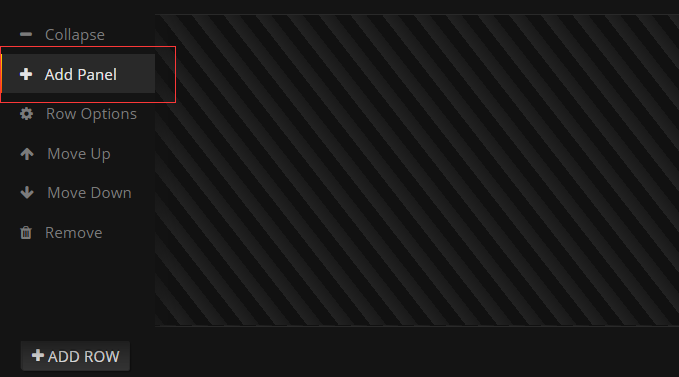
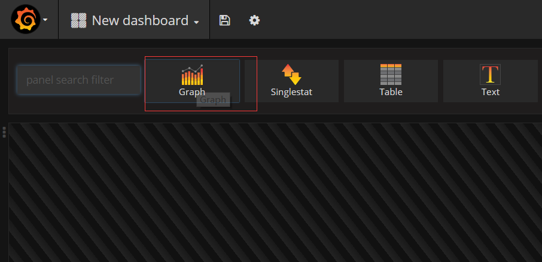
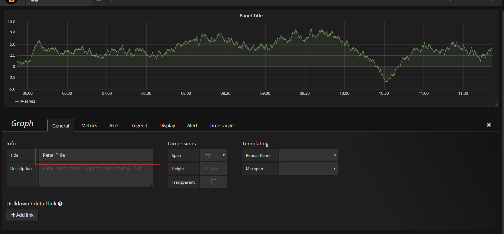
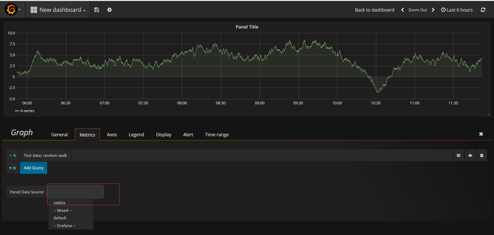
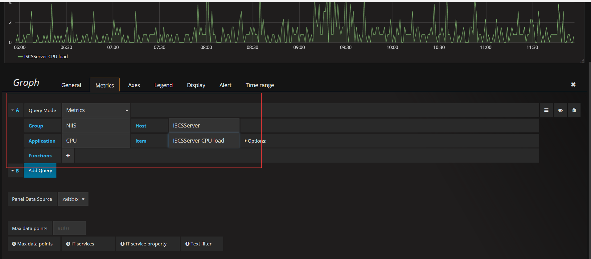
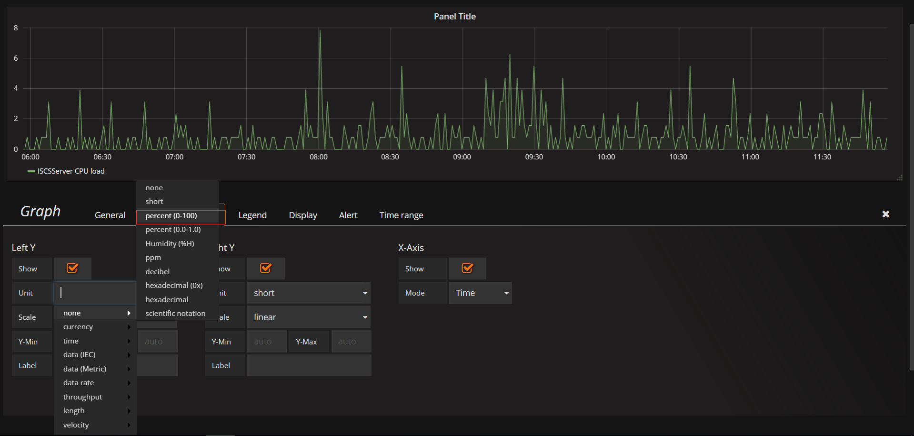
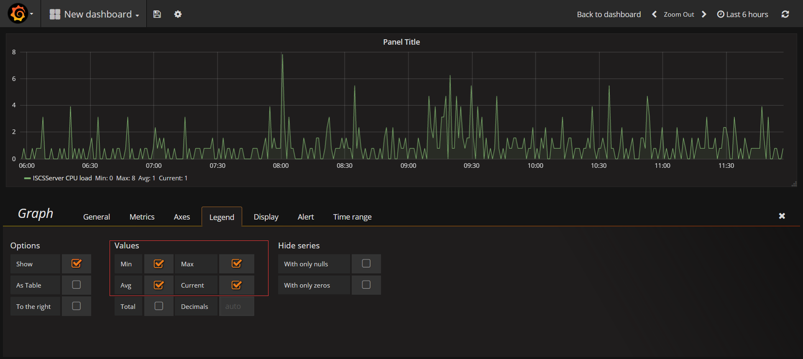
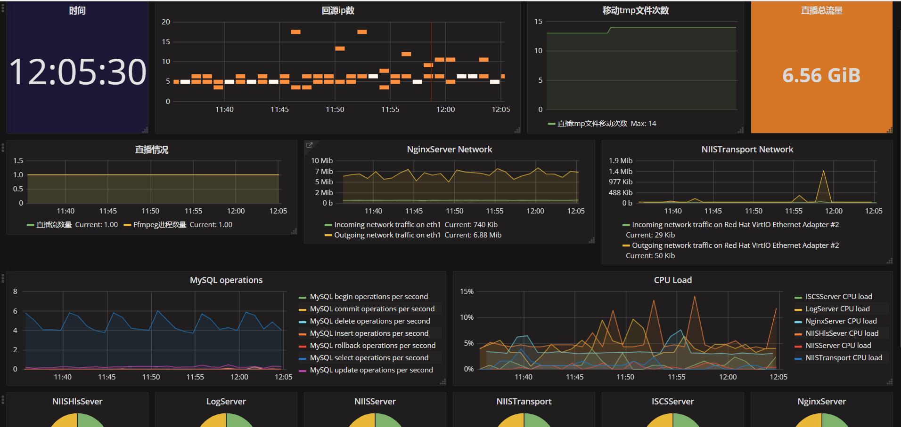

# Grafana数据展示

zabbix虽然有screen展示数据，但是图形类型很有限，并且不可以灵活的排列图形，所以我们借用Grafana进行数据展示。

安装请参考本博客地址的另一篇文章《自定义监控套件》

## 安装拓展组件

在命令行中输入以下命令添加组件

```bash
# 调用zabbix的组件
grafana-cli plugins install alexanderzobnin-zabbix-app
# 时钟组件，用于显示时间
grafana-cli plugins install grafana-clock-panel
# 饼图，用于对内存使用情况绘图
grafana-cli plugins install grafana-piechart-panel
```

更多组件的安装请参考https://grafana.com/plugins

## Grafana自定义Dashboard

第一步，进入的Dashboards界面



第二步，创建自定义的监控页面




第三步，添加行


第四步，添加图形




## Grafana调用zabbix

这里以走势图为例

第一步，添加一个走势图



第二步，点击名称的位置，修改走势图属性


第三步，修改走势图名称



第四步，修改数据类型



第五步，选着Zabbix的iterm



第六步，修改图形单位



第七步，选择需要显示统计数据



## 自定义的效果图

