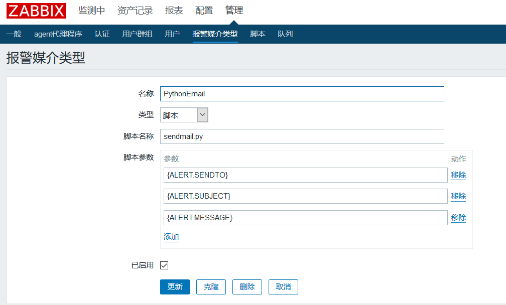

## 安装python34

安装python34(我使用的是阿里云的epel源)
```
yum install python34 -y
cd /usr/lib/zabbix/alertscripts/
```

编辑脚本文件`vim sendmail.py`

## 第一版
非常难用，最好使用第二版，通过第三方邮件服务发送邮件

```python
#!/usr/bin/python3
#coding: utf-8
import smtplib
import time
from email.mime.text import MIMEText
from email.header import Header

nowtime = time.strftime('%Y-%m-%d-%H:%M', time.localtime(time.time()))
sender = '********@21cn.com'
receiver = ['*******@163.com']
subject = 'ServerError at {}'.format(nowtime)
smtpserver = 'smtp.21cn.com'
username = sender
password = '******'

for i in receiver:
    msg = MIMEText('ServerError at {} please fix it'.format(nowtime),'plain','gb2312')
    msg['Subject'] = subject
    msg['From'] = sender
    msg['To'] = i
    smtp = smtplib.SMTP()
    smtp.connect(smtpserver)
    smtp.login(username, password)
    smtp.sendmail(sender, i, msg.as_string())
    smtp.quit()
```


## 版本二
这一版使用的是sendcloud发送邮件(请百度：)，可以通过zabbix传递的数据发送特定的邮件
```python
#!/usr/bin/python3
# coding: gb2312
import requests
import sys
# import json

# 获取要传递的参数
_, sendto, subject, *msgbody = sys.argv
url = "http://api.sendcloud.net/apiv2/mail/send"
# 您需要登录SendCloud创建API_USER，使用API_USER和API_KEY才可以进行邮件的发送。
params = {
    # apiUser
    "apiUser": "mortimer_****_******",
    # apiKey
    "apiKey": "******",
    "from": "service@sendcloud.im",
    # fromName
    "fromName": "*******",
    # 一下三个是通过zabbix传递参数，不需要修改
    "to": sendto,
    "subject": subject,
    "html": ' '.join(msgbody),
}

r = requests.post(url, files={}, data=params)
# print(r.text)
```

### 使用方法




传递的参数分别为
```
{ALERT.SENDTO}
{ALERT.SUBJECT}
{ALERT.MESSAGE}
```
