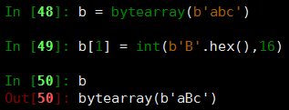

#### 字符串(属于线性结构)

    小于等于2.5使用printf style,大于2.5使用format

* printf style 字符串格式化

  从C语言继承过来的

  `s = 'i love %s%d'`待格式化的字符串， 当一个字符串存在占位符的时候， 占位符： %加一个格式控制符

  `s % ('python',3)`传入参数顺序的替换占位符， 返回替换后的字符串， 原串不变

  `'i love %s, i am %d' % ('Python', )`占位符个数和参数个数不匹配的时候， 会抛出TypeError

  

  `s = 'i love %s, i am %d'` `s % ('Python', '18')`当类型不匹配时， 会抛出TypeError

  

  `s % (18, 18)`当占位符是%s， 其实隐式调用了str()

  `'%r' % 18 # %r`隐式调用了 repr()

  ***函数str() 用于将值转化为适于人阅读的形式，而repr() 转化为供解释器读取的形式
（如果没有等价的语法，则会发生SyntaxError 异常） 某对象没有适于人阅读的解释形式的话， str() 会返回与repr()
   等同的值。很多类型，诸如数值或链表、字典这样的结构，针对各函数都有着统一的解读方式。***

* format

  `help(s.format)`

  `s = 'i love {}'`format方法使用大括号作为占位符

  `s.format('Python')`当调用format方法是， format传入的参数会替换大括号

  `s = 'i love {} i am {}'` `s.format('Python', 18 ,5)`format方法的参数个数是可变的,参数可以多于占位符

  `s = 'i love {1}, i am {0}'`可以在占位符里加数字指定format参数的位置

  `'{0} {0}'.format('haha')`参数可以通过指定位置方式多次使用

  `'i love {lang} i am {age}'.format(lang='Python', age=18)`可以在占位符里加标识符， 来使用关键字参数

  `'my name is {0} i love {lang} i am {age}'.format('comyn', lang='python', age=18)`同时支持位置参数和关键字参数

  `'{} {}'.format(18)`占位符多于参数个数会抛出异常

  

  `'{1} {2}'.format(0, 1, 2)`args = [0, 1, 2] args[1] args[2]

  `'{1}, {2}, {3}'.format(0, 1, 2)`args = [0, 1, 2]  args[1]  args[2] args[3]占位符和参数不匹配，会抛出异常

  `'{}{1}'.format(1,2,3,4,5,6)`

  


  

  总结
  ```
  {}  按照顺序，使用位置参数
  {数字 i} 会把位置参数当成一个列表 args, args[i]  当i不是args的索引的时候， 抛出IndexError
  {关键字 k} 会把关键字参数当成一个字典 kwargs, 使用kwargs[k]  当k不是kwargs的key时， 会抛出KeyError
  ```

#### bytes ***可以说是python3和python2最大的区别***

  str是文本序列，bytes是字节序列,Python3字符串默认使用utf-8编码

  GBK和UTF8有什么区别
  ```
  GBK编码：是指中国的中文字符，其它它包含了简体中文与繁体中文字符，另外还有一种字符“gb2312”，这种字符仅能存储简体中文字符。
  UTF-8编码：它是一种全国家通过的一种编码，如果你的网站涉及到多个国家的语言，那么建议你选择UTF-8编码。
  GBK和UTF8有什么区别？
  UTF8编码格式很强大，支持所有国家的语言，正是因为它的强大，才会导致它占用的空间大小要比GBK大，对于网站打开速度而言，也是有一定影响的。
  GBK编码格式，它的功能少，仅限于中文字符，当然它所占用的空间大小会随着它的功能而减少，打开网页的速度比较快。
  详细介绍链接http://www.cnblogs.com/xiaomia/archive/2010/11/28/1890072.html
  ```

* encode

  `help(s.encode)`查看详细文档

  `s = '马哥教育'` `s.encode()`把字符串UTF8编码为bytes

  `bin(0xe9)`把16进制转换为二进制

  `s.encode('GBK')`把字符串GBK编码为bytes

* decode

  `'b'\xe9\xa9\xac\xe5\x93\xa5\xe6\x95\x99\xe8\x82\xb2''.decode()`bytes.decode() 把bytes转化为str

  `b'\xe9\xa9'.decode('GBK')`把GBK编码的bytes转换为字符串

***encode和decode的使用场景，两个不同编码方式的主机间通信。
  socket通信使用的是bytes，乱码python3可以使用decode解决***

* bytes

  除了encode外，str操作，都有对应bytes的版本，但是传入参数也必须是bytes

  ` b'abc'.find(b'b')`find函数时，参数必须也是bytes

  `'马哥教育'.encode().find(b'\xa9')`bytes的操作是按字节来的

  `b.hex()`二进制可以转成十六进制

  `len('马哥教育'.encode())`统计字节数

* bytearray

  bytearray 是bytes的可变版本，str和bytes是不可变的

  `b[1] = int(b'B'.hex(),16)`修改bytearray

  

  bytearray的使用场景 **图片处理**，图片一般比较大比如100K，当有10240张图片修改10次后，就会占用1G内存

  相对bytes来说， 多了 insert, append, extend, pop, remove, clear reverse

  `b.append(b'b')`insert, append, remove, count参数必须是int

  `b.append(100000000000000000000000000000000000000000000000000000000000000000)`int必须在0 ~ 256这个范围内 即8位无符号整数

  bytearray的insert，append，remove，count参数必须是int ***int必须是0~256之间的无符号整数，因为操作的数据是单个字节，Python没有byte这种类型，byte可以使用int表示***   
